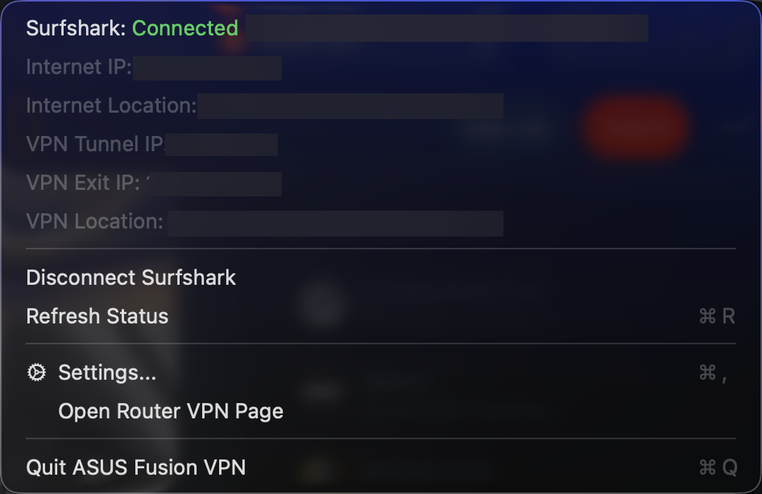
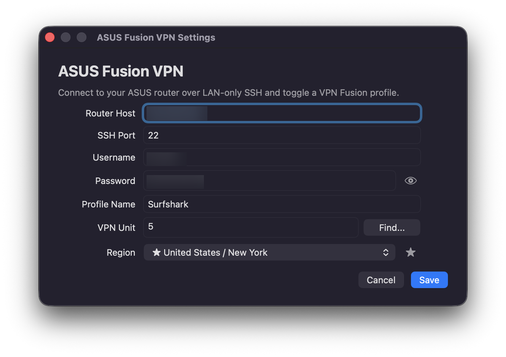

# ASUS Fusion VPN

<p align="center">
  
</p>

A native macOS menu bar app for toggling an ASUSWRT VPN Fusion profile over LAN-only SSH.

The app was built for an ASUS router running VPN Fusion with a Surfshark WireGuard profile. It shows connection state, router WAN identity, tunnel IP, VPN exit IP/location, and lets you connect, disconnect, refresh status, open settings, or jump to the router VPN page from the menu bar.

## Screenshots

The screenshots below intentionally redact local router details, usernames, IP addresses, and location data.

| Menu bar status | Settings |
| --- | --- |
|  |  |

## Features

- Menu bar status icon with connected, connecting, disconnected, and unknown states.
- One-click connect/disconnect for a configured VPN Fusion profile.
- Router status refresh every 30 seconds, with faster follow-up refreshes while the VPN is connecting.
- Surfshark region picker backed by Surfshark's public cluster catalog.
- Favorite regions sorted to the top of the region picker.
- Region changes can reconnect an active VPN profile automatically.
- Status details for Internet IP/location, WireGuard tunnel IP, VPN endpoint IP, and VPN location.
- Settings window for router host, SSH port, username, password, profile name, VPN unit, and region.
- No background daemon and no web server; the app only talks to the router when refreshing status or toggling the VPN.

## Requirements

- macOS 14 or newer.
- Swift 6 toolchain or Xcode command line tools capable of building Swift Package Manager projects.
- An ASUSWRT router reachable from your Mac over LAN SSH.
- SSH enabled on the router for LAN access.
- A VPN Fusion WireGuard client profile already configured on the router.
- Router shell tools used by the app commands: `nvram`, `service`, `ip`, `wg`, `ifconfig`, `nslookup`, and `curl`.
- macOS `/usr/bin/ssh` and `/usr/bin/expect`.

## Defaults

| Setting | Default |
| --- | --- |
| Router host | `192.168.1.1` |
| SSH port | `22` |
| Profile name | `Surfshark` |
| VPN Fusion unit | `5` |
| Region | `United States / New York` |

These are starter defaults only. Open `Settings...` from the menu bar app before using it on your router, and use `Find...` to discover the VPN Fusion unit for your profile.

## Install

Download the latest DMG from [GitHub Releases](https://github.com/moebis/asus-fusion-vpn/releases), then:

1. Open the downloaded `ASUS-Fusion-VPN-<version>-universal.dmg`.
2. Drag `ASUS Fusion VPN.app` to `Applications`.
3. Launch `ASUS Fusion VPN` from `Applications`.
4. Open the menu bar item, choose `Settings...`, and enter your router SSH details.

The release build is unsigned and not notarized. macOS may require opening it via Finder's context menu the first time: right-click the app, choose `Open`, then confirm.

## Build From Source

Clone the repository, then run:

```zsh
swift test
./Scripts/build-app.sh
```

The app bundle is written to:

```text
dist/ASUS Fusion VPN.app
```

The build also creates a compressed universal DMG containing the app and an `Applications` shortcut:

```text
dist/ASUS Fusion VPN.dmg
```

Run it with Finder or:

```zsh
open "dist/ASUS Fusion VPN.app"
```

Local builds are also unsigned and not notarized.

Release notes are maintained in [CHANGELOG.md](CHANGELOG.md).

## Router SSH Setup

This app controls the router with SSH, so SSH must be enabled on the router before the app can refresh status or toggle VPN Fusion.

Exact ASUSWRT labels vary by router and firmware, but the setup is usually:

1. Sign in to the ASUS router web UI.
2. Open `Administration` -> `System`, then find the SSH settings.
3. Enable SSH for LAN/local network access.
4. Leave SSH from WAN/internet disabled unless you explicitly know you need it.
5. Note the SSH port. Many routers use `22`, but your router may use a custom port.
6. Apply the router settings.

You can test access from Terminal:

```zsh
ssh -p 22 username@192.168.1.1
```

Replace `22`, `username`, and `192.168.1.1` with your router's SSH port, admin username, and LAN address. Use the same values in the app's Settings window.

## Configuration

Open the menu bar item and choose `Settings...`.

Set:

- `Router Host`: LAN IP or hostname for your ASUS router.
- `SSH Port`: router SSH port. Use the custom port from the router UI if it is not `22`.
- `Username` and `Password`: router SSH credentials.
- `Profile Name`: the VPN Fusion profile name shown in the router UI.
- `VPN Unit`: the ASUS VPN Fusion unit number for that profile. Use `Find...` to discover it from the router.
- `Region`: Surfshark endpoint to write into the WireGuard profile when connecting.
- `Show IP location details`: when enabled, the app asks the router to fetch display-only IP location labels.

The router password is stored in macOS Keychain. Non-secret settings such as router host, SSH port, username, profile name, VPN unit, region, favorites, and location-display preference are stored in the app's macOS preferences. If you used an older build, the app migrates the saved router password out of preferences and removes the legacy preference value after the Keychain save succeeds.

## Finding the VPN Unit

Each VPN Fusion profile has an internal unit number. The default `5` is only a starting value, and other routers may assign a different unit.

In the Settings window, click `Find...` next to `VPN Unit`. The app will make a read-only SSH request to the router, read `vpnc_clientlist`, and either fill the unit for the matching profile name or show a chooser if several VPN Fusion profiles are available.

If you need to check manually, you can discover the same value over SSH:

```zsh
ssh -p 22 username@192.168.1.1
nvram get vpnc_clientlist | tr '<' '\n'
```

Replace `22`, `username`, and `192.168.1.1` with your router values.

Look for the row whose name matches the VPN Fusion profile you want the app to control. For example:

```text
Surfshark>Surfshark>5>>>1>5>>>0>0>Web
```

In this example, the VPN unit is `5`. ASUSWRT stores profile data as `>` separated fields, and the unit typically appears as the profile's numeric client/unit field. If you have multiple VPN Fusion profiles, choose the unit from the row matching your configured `Profile Name`.

## Router Behavior

The app reads router state with SSH commands that inspect ASUSWRT `nvram`, the `wgc<unit>` WireGuard interface, the route table matching the configured VPN unit, policy rules, and optional `ipinfo.io` responses for display-only location labels.

The app keeps its own SSH `known_hosts` file under macOS Application Support and pins the router host key there after the first successful connection. This keeps the app from modifying your personal SSH `known_hosts` file. Like normal SSH trust-on-first-use, the very first connection assumes your LAN is trustworthy. If you want to verify the router key before first use, run:

```zsh
ssh-keyscan -p 22 192.168.1.1 | ssh-keygen -lf -
```

Replace `22` and `192.168.1.1` with your router SSH port and LAN address, then compare the fingerprint to a fingerprint gathered from a trusted router administration session.

When connecting, it:

- Updates the configured VPN Fusion profile active flag in `vpnc_clientlist`.
- Sets `vpnc_unit` to the configured unit.
- Writes the selected Surfshark endpoint host and peer public key into the WireGuard profile.
- Resolves the endpoint host and stores the resolved endpoint IP when available.
- Runs `nvram commit`.
- Runs `service restart_vpnc`.
- Re-applies saved VPN Fusion device policy rules for the selected unit.

When disconnecting, it:

- Clears the configured VPN Fusion profile active flag in `vpnc_clientlist`.
- Sets `vpnc_unit` to the configured unit.
- Runs `nvram commit`.
- Runs `service stop_vpnc`.
- Removes stale policy rules, flushes the VPN route table, and deletes the stale `wgc<unit>` runtime interface if ASUSWRT leaves it behind.

Review [VPNFusionRouterCommands.swift](Sources/ASUSFusionVPN/VPNFusionRouterCommands.swift) before using this on a different firmware or VPN Fusion setup.

## Development

Useful commands:

```zsh
swift test
swift build
swift build -c release --arch arm64 --arch x86_64
./Scripts/build-app.sh
```

Project layout:

```text
Sources/ASUSFusionVPN/       App source
Tests/ASUSFusionVPNTests/    Swift Testing test suite
CHANGELOG.md                 Public release notes
LICENSE                      MIT license
Scripts/build-app.sh         Release app bundle builder
Scripts/generate-dmg-background.swift DMG background artwork generator
Scripts/generate-icons.swift App icon generator
Assets/AppIcon/              Source icon image
docs/assets/                 README screenshots and branding images
```

Build products are intentionally ignored:

```text
.build/
dist/
.DS_Store
```

## Troubleshooting

- `Open Settings and enter the router username and password.`: credentials have not been saved yet.
- SSH connection fails: confirm SSH is enabled for LAN access on the router, the Mac is on the same local network, and the app's `SSH Port` matches the router's SSH port.
- Status stays `Connecting`: the profile is active, but the app has not seen a fresh WireGuard handshake and live runtime state yet.
- Router status works but location is unavailable: the router may not be able to reach `ipinfo.io`, `curl` may not be available on the router, or `Show IP location details` may be turned off.
- Saving settings fails with a Keychain error: unlock the Mac login keychain, relaunch the app, and save settings again.
- Build errors mention the old project path: run `swift package clean` and build again. This can happen after copying the project to a new folder.
- App cannot control the profile: confirm the VPN Fusion unit number matches the router profile and review the generated router commands.

## Privacy and Safety

This app is intentionally small and local:

- It does not collect analytics.
- It does not expose a local HTTP server.
- It does not run a separate daemon.
- It connects to Surfshark's public cluster API to refresh region choices.
- If `Show IP location details` is enabled, it asks the router to call `ipinfo.io` for display-only IP/location labels.
- It stores the router password in macOS Keychain and removes the legacy saved-password preference from older app builds after migration.

The app changes router VPN state over SSH. Use it only with a router and profile you control.

## License

ASUS Fusion VPN is released under the MIT License. See [LICENSE](LICENSE).
